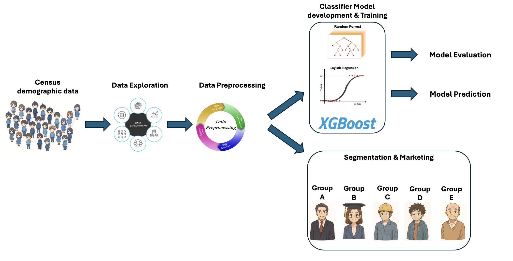

## Project Overview

This repository implements a complete end-to-end machine learning workflow for predicting income categories (above/below $50,000) and segmenting the U.S. Census demographic dataset.
It includes data exploration, preprocessing, model training, evaluation, prediction, and segmentation analysis, in the end some marketing recommendations are provided for different group of people. **Please see project Report as Chuanye_Project_Report.pdf.**

## Folder architecture

data/ -> contains all the raw and preprocessed data <br>
models/ -> contains all the classifier model as .pkl file and the encoder and scaler .pkl <br>
notebooks/ -> contains all the jupyter notebook file, which is step-by-step analysis of the task <br>
src/ -> contains the source code .py file

## Installation of environment

Anaconda is the prerequisite

1. Create the environment from the YAML:
   ```
   conda env create -f env.yml
   ```
2. Activate the env:
   ```
   conda activate chuanye_jpm_project
   ```

P.S. Due to GitHub’s file size limitations, the current `.data` file only contains 10000 sample rows for demonstration purposes. Put `census-bureau.data` contains all the information under `data/raw/` folder and replace the current one.

Executing the code

Training the three classifier models (1. logistic regression; 2. random forest; 3. XGBoost)

first of all, go to the source code folder

```
cd src/
```

```
python train.py
```

Evaluate the three ML models

```
python evaluation.py
```

Predict the new results

```
python predict.py
```

For running the segmentation models, please see the `notebooks/04_segmentation_model.ipynb`
